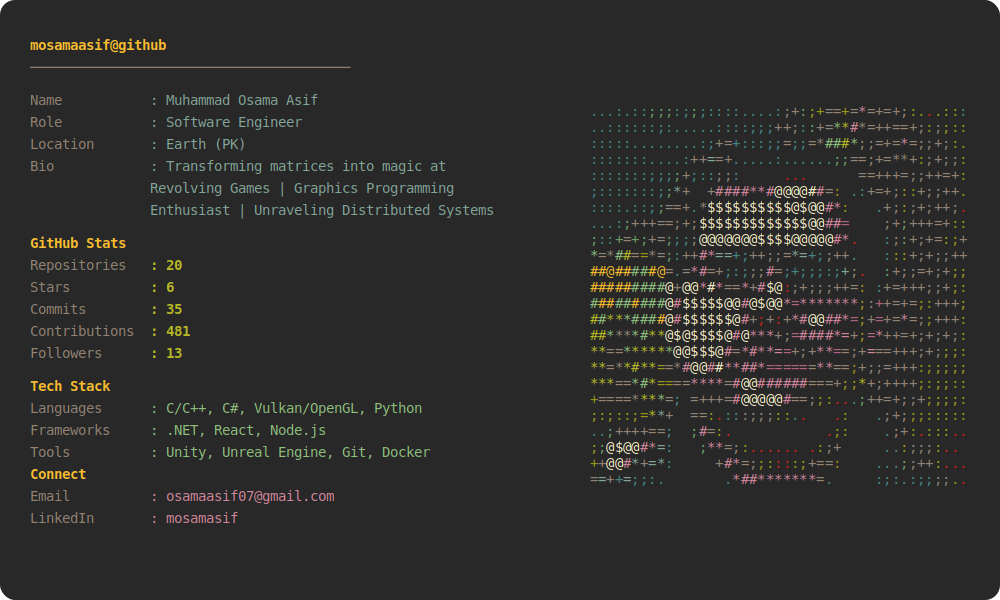

# Hi there! 👋

---

## About This Profile

This terminal-styled profile is automatically updated daily with my latest GitHub statistics using GitHub Actions.

- **Theme**: Gruvbox Dark
- **Tech Stack**: Python, SVG, lxml, GitHub Actions
- **Inspiration**: [Andrew6rant](https://github.com/Andrew6rant/Andrew6rant)

### Features

✨ **Automatic Updates**: GitHub Actions runs daily to fetch and update statistics
🎨 **Dual Theme**: Automatically switches between dark and light mode based on system preferences
🖼️ **Colored ASCII Art**: Portrait rendered in ASCII with Gruvbox color palette
📊 **Live Stats**: Real-time repository, star, commit, and contribution counts
🛠️ **Tech Stack**: Displays languages, frameworks, tools, and databases
🔗 **Social Links**: Easy access to connect via email, LinkedIn, and Twitter

---

## Want to Create Your Own?

Check out the **[Setup Guide](SETUP.md)** for detailed instructions on creating your own terminal-styled GitHub profile!

---

## Credits

- **Gruvbox Theme**: [morhetz/gruvbox](https://github.com/morhetz/gruvbox)
- **Inspiration**: [Andrew6rant](https://github.com/Andrew6rant/Andrew6rant)
- **ASCII Art**: Pillow image processing library

---

## License

This project is open source and available under the MIT License.

---

*Last updated: Automatically via GitHub Actions*

  Built with ❤️ using Claude Code

